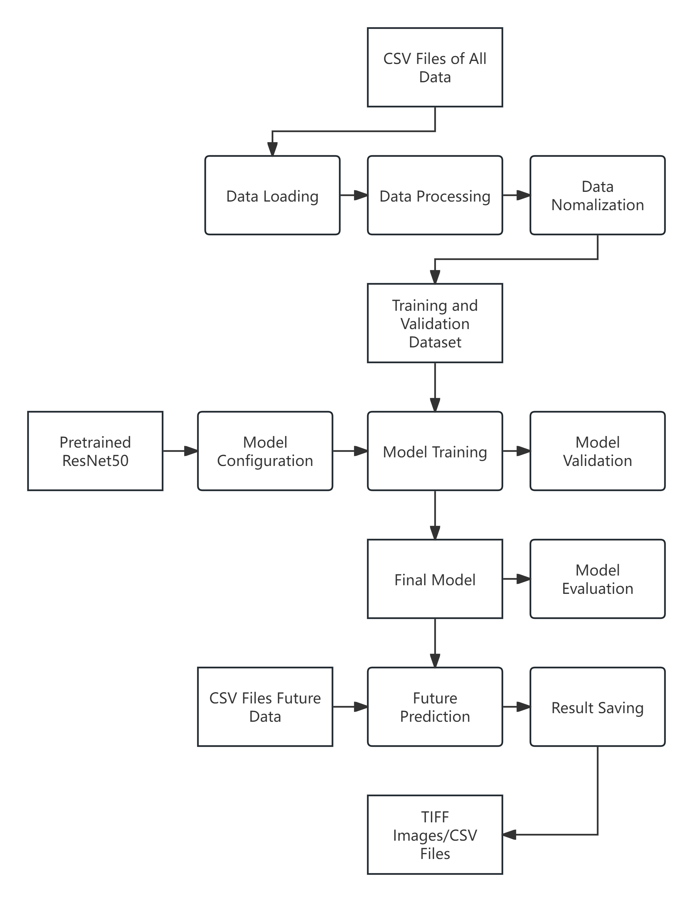

## Introduction to ResNet50

ResNet50, a variant of the ResNet (Residual Network) model, was designed primarily for image recognition tasks and has become a foundational model in the field of deep learning. Originating from a 2015 paper by Kaiming He and colleagues from Microsoft, this model has broadly influenced both academic research and practical applications beyond its initial domain.

### Core Features of ResNet50:

- **Architecture:** 
  ResNet50 includes 50 layers deep, comprising convolutional layers, batch normalization, and ReLU activations. Its design addresses the challenge of training deep networks by mitigating the vanishing gradient problem.

  1. **Initial Layers:**
     - The network starts with a single **convolutional layer** with a 7x7 kernel and a stride of 2, immediately followed by a max pooling layer. This setup helps in reducing the spatial dimensions of the input image while capturing essential features.

  2. **Stacked Residual Blocks:**
     - The core of ResNet50 consists of a series of "residual blocks" stacked together. Each block has a standard structure:
       - **Bottleneck Design:** To manage the model size and complexity, each block uses a bottleneck design with three layers:
         - A 1x1 convolution that reduces the dimensionality.
         - A 3x3 convolution that processes the data.
         - Another 1x1 convolution that expands the dimensions back, preparing for the addition operation.
       - **Skip Connections:** Each block includes a shortcut (or skip connection) that adds the input of the block to its output, which helps in mitigating the vanishing gradient problem by allowing gradients to flow directly through these connections during backpropagation.

  3. **Batch Normalization and ReLU Activations:**
     - Each convolutional operation is followed by **batch normalization**, which normalizes the activations of the previous layer by adjusting and scaling the activations. This helps in stabilizing the learning process and improving convergence rates.
     - **ReLU activation** functions are used after each batch normalization to introduce non-linearities into the model, helping it to learn more complex patterns in the data.

  4. **Final Layers:**
     - After passing through the residual blocks, the network concludes with global average pooling followed by a fully connected layer that maps the features learned by the network to the desired number of output classes.

  5. **Output:**
     - The output is a softmax layer that provides a probability distribution over the classes for classification tasks.

- **Residual Connections:** 
  The defining feature of ResNet is its use of residual connections, which bypass one or more layers by adding the input of a layer directly to a deeper layer's output. 
  These connections facilitate gradient flow during training, enabling the effective training of networks that are much deeper than was previously feasible.

- **Broad Applicability:** 
  Although designed for image classification, the principles of ResNet50 can be adapted for a variety of tasks outside computer vision. Its ability to handle deep architectures effectively makes it an excellent candidate for complex problems in other fields such as audio processing, time-series analysis, and even genomics, where large trainable models are beneficial.

- **Pre-trained Models:** 
  ResNet50 is often used as a pre-trained model, meaning it has been previously trained on a large dataset (like ImageNet) and can be fine-tuned for specific tasks in other domains. This approach can significantly reduce the time and data required to develop effective models.

### Significance in Research:

ResNet50's introduction marked a significant improvement in handling deep neural networks, influencing subsequent research and developments in network architecture. 
It offers a practical example of how deep learning can be applied effectively, providing insights into both the theoretical and practical aspects of building and training deep models.

## Model Training and Prediction Process Summary

### Data Preparation
1. **Data Loading:**
   - Load data for variables such as height above geoid, pressure at sea floor, salinity, temperature, and water mass from CSV files.
   - Files should be named according to specific patterns and stored in designated directories (e.g., `heightabovegeoid_*.csv`).

2. **Data Processing:**
   - Read data from CSV files into NumPy arrays.
   - Create a synthetic 'month' feature, repeated across spatial dimensions to align with other features, ensuring each sample is timestamped.
   - Stack data from different variables to form a single multidimensional array suitable for convolutional neural network processing.

3. **Data Normalization:**
   - Standardize features using `StandardScaler` to help with convergence during model training.

4. **Tensor Conversion and DataLoader Setup:**
   - Convert data arrays to PyTorch tensors.
   - Split datasets into training and validation sets.
   - Use PyTorch `DataLoader` for batching, shuffling, and parallel data loading during training.

### Model Setup
1. **Model Configuration:**
   - Adapt a pre-trained ResNet50 model by modifying the first convolutional layer and the final fully connected layer to suit the input and output dimensions, respectively.
   - Modify the network to output a tensor that matches the spatial dimensions of the input data.

2. **Loss and Optimizer:**
   - Use Mean Squared Error (MSE) for the loss function.
   - Employ the Adam optimizer for weight adjustment.

### Training Process
1. **Batch Processing:**
   - In each batch, perform a forward pass, calculate loss, and update model parameters based on the loss gradient.
   - Log training metrics such as loss for monitoring.

2. **Validation:**
   - Evaluate loss and other statistics (MSE, MAE, R² score) on the validation set to monitor overfitting and performance on unseen data.

### Prediction and Evaluation
1. **Model Evaluation:**
   - Use the trained model to make predictions on new data.
   - Evaluate model performance using metrics like MSE, MAE, and $R^2$ score.

2. **Future Predictions:**
   - Prepare and normalize data for future months similarly to training data preparation.
   - Make predictions using the processed input features for future months.

3. **Saving Results:**
   - Save predictions as CSV files or geospatial TIFF images, using `rasterio` for spatial metadata handling.

### Additional Functionalities
- Functions are included for extracting and saving time-series data for specific geographic points, demonstrating handling of spatial data and insights derivation at specific locations.